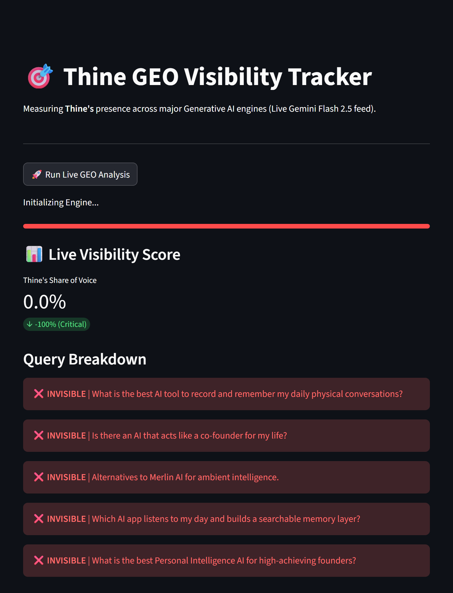
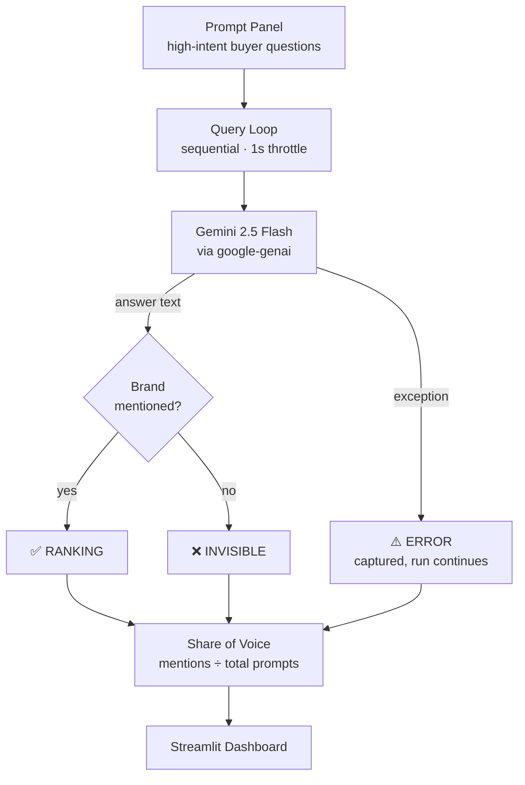
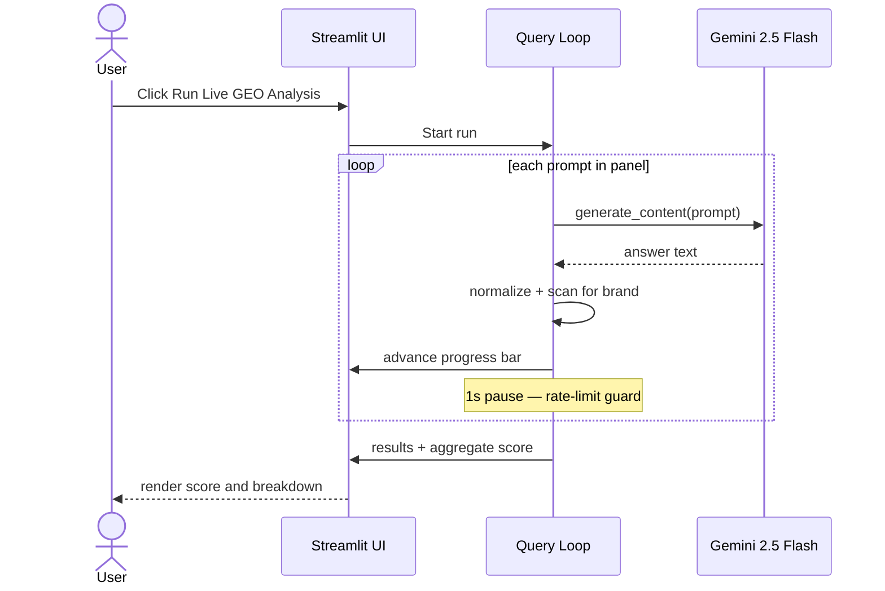

<div align="center">

# 🎯 GEO Tracker

**Measure whether a brand actually shows up in AI-generated answers.**

[](https://www.python.org/)
[](https://streamlit.io/)
[](https://ai.google.dev/)

</div>

---

## Why this exists

Buyers have started asking a language model instead of a search engine. *"What's the best tool for X?"* now gets answered in a paragraph, not a page of blue links — and that paragraph names two or three products.

If your brand isn't one of them, you're invisible at the exact moment of intent. And this is a genuinely new blind spot: a brand can rank #1 on Google and still never appear in the answer an LLM gives, because the model is recalling what it learned, not reading your meta tags. Traditional SEO tooling cannot see this surface at all.

**Generative Engine Optimization (GEO)** is the practice of fixing that. But optimization needs a baseline — you can't improve a number you've never measured.

GEO Tracker is a small instrument for exactly that measurement: it asks a generative engine the questions real buyers ask, then checks whether a given brand survives into the answer.

---

## What it does

1. Fires a panel of **high-intent buyer questions** at a generative engine
2. Scans each returned answer for the **tracked brand**
3. Computes a **Share of Voice** score across the panel
4. Renders a per-query breakdown of exactly where the brand ranked or vanished

<div align="center">

<br>
<sub><i>A real run — five high-intent queries, zero brand mentions, 0% Share of Voice.</i></sub>
</div>

---

## Pipeline

How a single run moves through the system, including the failure path:



A failed call is caught rather than thrown — one bad response degrades the score instead of killing the run.

## Run lifecycle



---

## Scoring

The metric is deliberately blunt — presence, not sentiment:

```
Share of Voice = (prompts where the brand appears ÷ total prompts) × 100
```

Detection is a **case-insensitive substring match** against the full answer text. Every prompt is scored binary — `RANKING` or `INVISIBLE` — with no partial credit and no weighting by position in the answer.

That simplicity is intentional for a baseline: it's cheap, deterministic, and hard to argue with. Its limits are real, and listed [below](#limitations).

---

## Tech stack

| Layer | Choice | Why |
| --- | --- | --- |
| Engine | Gemini 2.5 Flash | Fast and cheap enough to poll a whole prompt panel interactively |
| SDK | `google-genai` | Official Google GenAI Python client |
| Interface | Streamlit | Live progress and metrics without writing a frontend |
| Config | `python-dotenv` | Keeps the API key out of source control |

---

## Getting started

**Prerequisites** — Python 3.10+ and a [Google AI Studio](https://aistudio.google.com/app/apikey) API key.

```bash
# 1. Clone
git clone https://github.com/chinmoypaul8897/thine-geo-tracker.git
cd thine-geo-tracker

# 2. Create and activate a virtual environment
python -m venv venv
source venv/bin/activate        # Windows: venv\Scripts\activate

# 3. Install dependencies
pip install -r requirements.txt
```

Copy the example env file and add your key:

```bash
cp .env.example .env            # Windows: copy .env.example .env
```

```env
GEMINI_API_KEY=your_google_ai_studio_key_here
```

Then launch:

```bash
streamlit run main.py
```

The app opens at `http://localhost:8501`. Hit **Run Live GEO Analysis** to execute a live run.

> `.env` is gitignored — your key never enters the repository.

---

## Tracking your own brand

Both the brand and the prompt panel live in [`main.py`](main.py), so pointing this at a different product is a two-line change.

**The prompt panel** — the questions your buyers would actually type:

```python
prompts = [
    "What is the best AI tool to record and remember my daily physical conversations?",
    "Is there an AI that acts like a co-founder for my life?",
    # ...
]
```

**The detection target** — the brand string scanned for in each answer:

```python
if "thine" in text:
```

The bundled panel tracks a sample SaaS brand across five ambient-AI queries. Swap both for your own and the score recalculates against your category.

---

## Limitations

Known trade-offs, stated plainly — most of these are the natural next build:

- **Substring matching is naive.** A brand whose name is a common word will false-positive, and the match can't distinguish a recommendation from a passing mention or a criticism.
- **Errors count as misses.** A failed API call scores as `INVISIBLE` rather than being excluded from the denominator, so network flakiness depresses the score.
- **Single engine.** Only Gemini is polled. Real coverage means ChatGPT, Claude, and Perplexity too, since each model recalls a different slice of the web.
- **No persistence.** Every run is a fresh snapshot. The genuinely useful signal is the trend line, which needs a datastore behind it.
- **Non-deterministic by nature.** LLM output varies between calls, so a single run is a sample, not a measurement. Repeated sampling would give real confidence intervals.
- **Sequential execution.** Prompts run one at a time with a fixed pause. Async batching would make a large panel practical.

---

## What I'd build next

Where I'd take this if the baseline proved worth acting on:

- **Multi-engine polling** — ChatGPT, Claude, and Perplexity alongside Gemini, since each model recalls a different slice of the web
- **Entity-aware detection** — replace substring matching with something that distinguishes a recommendation from a passing mention
- **Historical persistence** — a datastore behind the runs, turning snapshots into a visibility trend line
- **Competitor benchmarking** — relative Share of Voice against named rivals rather than an absolute number
- **Repeated sampling** — several runs per prompt to produce confidence intervals instead of a single sample
- **Async batching** — concurrent calls so a large prompt panel stays practical

---

## License

[MIT](LICENSE) © Chinmoy Paul

<div align="center">
<sub>Built by <a href="https://github.com/chinmoypaul8897">Chinmoy Paul</a></sub>
</div>
