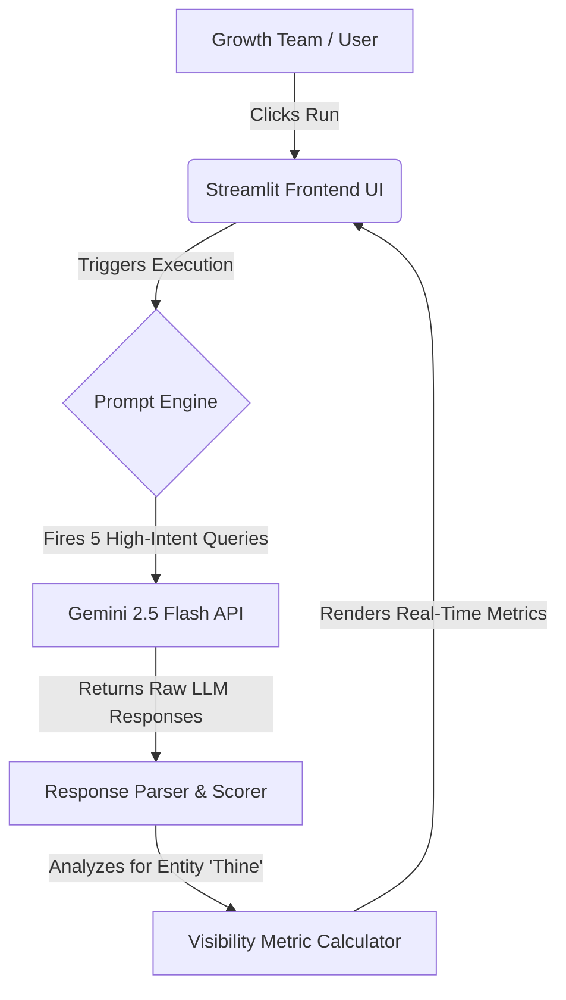

# 🎯 Thine GEO (Generative Engine Optimization) Tracker

[](https://thine-geo-report.streamlit.app/)

## 📌 The Problem: The Ambient AI Blindspot
Thine is building a "co-founder for your life," an ambient intelligence layer that requires high trust and targets high-achieving elite users. 

However, the modern elite do not search Google for productivity tools; they query Large Language Models (LLMs). Currently, when high-intent users ask major LLMs for "ambient AI" or "personal intelligence," **Thine is entirely invisible**, losing organic mindshare to basic transcription wrappers. 

Traditional performance marketing cannot fix this. You cannot buy your way to the top of an LLM's context window. You have to engineer your way in.

## 🛠️ The Solution: Growth Engineering
To acquire the elite, Thine must hijack Generative Engine Optimization (GEO). But you cannot optimize what you cannot measure. 

I built this automated data pipeline to solve this exact growth bottleneck. It continuously queries state-of-the-art LLMs, parses the outputs, and calculates Thine's organic "Share of Voice."

### ⚙️ System Architecture



### 💻 Tech Stack
* **Backend Core:** Python 3.10+
* **AI Engine:** Google GenAI SDK (Gemini 2.5 Flash for high-speed, low-latency inference)
* **Frontend & Hosting:** Streamlit & Streamlit Community Cloud
* **Environment Management:** `python-dotenv`

---

## 🚀 Local Installation & Deployment
To run this pipeline locally and test the inference engine:

1. **Clone the repository:**
   ```bash
   git clone [https://github.com/chinmoypaul8897/thine-geo-tracker.git](https://github.com/chinmoypaul8897/thine-geo-tracker.git)
   cd thine-geo-tracker
   ```

2. **Create and activate a virtual environment:**
   ```bash
   python -m venv venv
   source venv/bin/activate  # On Windows: venv\Scripts\activate
   ```

3. **Install dependencies:**
   ```bash
   pip install -r requirements.txt
   ```

4. **Environment Variables:**
   Create a `.env` file in the root directory and add your API key:
   ```env
   GEMINI_API_KEY=your_google_ai_studio_key_here
   ```

5. **Initialize the Server:**
   ```bash
   streamlit run main.py
   ```

---

